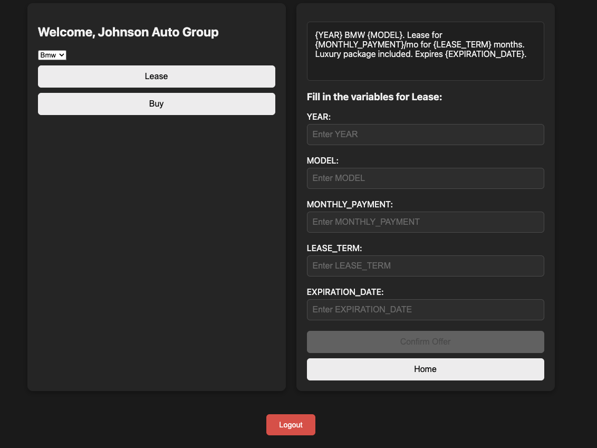

# Auto Dealer Offers

A template-based system for car dealerships to generate professional, legally-compliant promotional offers.



## The Problem

Car dealerships need to create lease and purchase offers with specific legal language, pricing terms, and expiration dates. Writing these from scratch is tedious and error-prone. Miss a disclosure? Legal trouble. Wrong APR format? Compliance issue.

## The Solution

Pre-built templates with fill-in-the-blank variables. Select your brand, choose Lease or Buy, fill in the numbers, and get a professional offer ready to publish. Real-time preview shows exactly what customers will see.

## How It Works

1. **Select a Brand** - Choose from your dealership's inventory (BMW, Tesla, Ford, etc.)
2. **Choose Offer Type** - Lease or Buy templates have different variables
3. **Fill Variables** - Enter year, model, monthly payment, APR, terms, expiration date
4. **Live Preview** - Watch the offer update as you type
5. **Generate & Copy** - One-click copy to clipboard for ads, emails, or print

## Features

- **Multi-Brand Support** - Each dealership has access to their specific brands
- **Lease Templates** - Monthly payment, term length, down payment, mileage allowances
- **Buy Templates** - APR rate, financing term, tech packages, warranties
- **Real-Time Preview** - See the final offer as you fill in variables
- **Auto-Formatting** - Currency, percentages, and dates format automatically
- **Copy to Clipboard** - One click to grab the finished offer
- **Built-in Help** - Modal guide explains exactly how to use the app (click the ? button)

## Demo

The demo is logged in as **Johnson Auto Group** with access to:
- BMW
- Tesla  
- Ford

Each brand has its own lease and buy templates with brand-specific legal language.

## Tech Stack

- Vanilla JavaScript
- Vite
- JSON-based templates and user data

## Live Demo

**[→ View Live Demo](https://josdic1.github.io/appliance-demo/)**

Click the **?** button in the corner for a walkthrough of how the app works.

## Run Locally

```bash
git clone https://github.com/josdic1/appliance-demo.git
cd appliance-demo
npm install
npm run dev
```

## Why This Matters

Dealerships run on promotions. Every month there's a new offer to publish across websites, social media, email, and print. This tool eliminates copy-paste errors, ensures legal compliance, and saves hours of manual formatting. Built for the people actually creating these offers - not the lawyers reviewing them.